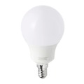
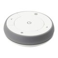
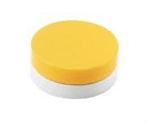

# Ikea (Trådfri)

## Compatibilité (non exhaustive)

|Photo | Nom | Ids | Commentaire |
| ------ | ----------- |------ | ----------- |
||Ampoule Tradfri E14|TRADFRI_bulb_E14_WS_opal_400lm||
||Ampoule Tradfri E27|TRADFRI_bulb_E27_WS_opal_980lm TRADFRI_bulb_E27_W_opal_1000lm TRADFRI_bulb_E27_opal_1000lm||
||Ampoule Tradfri E27 Couleur|TRADFRI_bulb_E27_CWS_opal_600lm||
||Ampoule Tradfri GU10|TRADFRI_bulb_GU10_W_400lm TRADFRI_bulb_GU10_WS_400lm||
||Télécommande Tradfri|TRADFRI_remote_control||
||Variateur d'intensité Tradfri|TRADFRI_wireless_dimmer||

## Références

* [Liste des vidéos tutorielles Ikea sur YouTube](https://www.youtube.com/watch?v=0z1KikVkHsw&list=PLdOi3lRbWE5JW3sM8vlHZRt16MquGiBvz)

## Informations générales

### Lien entre les télécommandes et ZiGate

Pour associer une télécommande (bouton, variateur) avec une ampoule sans rompre le lien entre l'ampoule et ZiGate, il faut d'abord associer la télécommande avec Zigate. La raison est que le réseau ZigBee est contrôlé par la ZiGate. Pour que la télécommande soit sur le même réseau que l'ampoule, elle doit donc être connue de ZiGate.

## Mode opératoire

### Ajout d'une ampoule

1. Allumer l'ampoule
1. Passer le plugin en mode *Inclusion*
1. Eteindre et allumer l'ampoule (par la télécommande physique) 6 fois (donc 12 appuis)
1. L'ampoule doit clignoter pour signifier que l'inclusion a réussi
1. Dans Jeedom, l'ampoule doit apparaître avec un nom aléatoire. La renommer et choisir le parent si besoin
1. Sauvegarder l'ampoule
1. Resynchroniser l'ampoule
1. Patienter quelques temps que les données soient bien remontées dans Jeedom. Si les données mettent du temps, demander une synchronisation dans le plugin ZiGate

### Ajout d'une télécommande

La télécommande doit être associée à ZiGate, [voir pourquoi](#lien-entre-les-télécommandes-et-zigate).

Si la télécommande est déjà associée avec ZiGate, par exemple lors de l'ajout d'une nouvelle ampoule, seule l'association entre la télécommande et l'ampoule est nécessaire

1. Ouvrir la télécommande pour accéder au bouton d'association
1. Passer le plugin en mode *Inclusion*
1. Appuyer 4 fois sur le bouton d'association de la télécommande
1. La télécommande doit apparaître dans Jeedom avec un nom aléatoire
1. Resynchroniser la télécommande
1. Associer la télécommande avec les ampoules une à une [voir la vidéo](https://www.youtube.com/watch?v=JRYFEuQhkIE)
    1. Approcher la télécommande à 2 cm de l'ampoule
    1. Appuyer pendant environ 10 secondes sur la télécommande d'association, jusqu'à ce que l'ampoule varie sa luminosité

### Ajout d'un variateur

le variateur doit être associé à ZiGate, [voir pourquoi](#lien-entre-les-télécommandes-et-zigate).

Si le variateur est déjà associée avec ZiGate, par exemple lors de l'ajout d'une nouvelle ampoule, seule l'association entre le variateur et l'ampoule est nécessaire

1. Ouvrir le variateur pour accéder au bouton d'association
1. Passer le plugin en mode *Inclusion*
1. Appuyer 4 fois sur le bouton d'association du variateur
1. Le variateur doit apparaître dans Jeedom avec un nom aléatoire
1. Resynchroniser le variateur
1. Associer le variateur avec les ampoules une à une [voir la vidéo](https://www.youtube.com/watch?v=_XxYk6Twm34)
    1. Approcher la télécommande à 2 cm de l'ampoule
    1. Appuyer pendant environ 10 secondes sur la télécommande d'association, jusqu'à ce que l'ampoule varie sa luminosité
