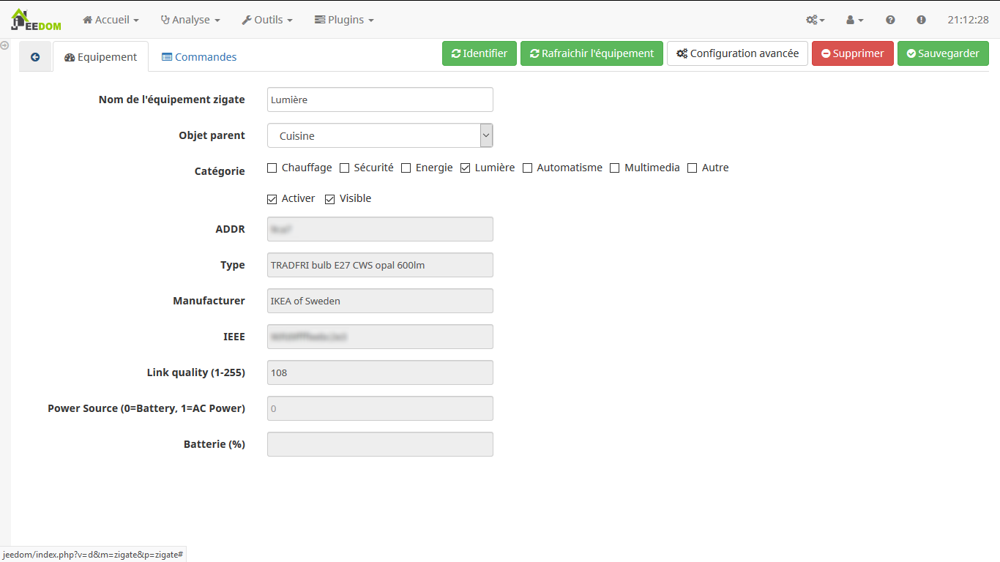

# Plugin ZiGate pour Jeedom

## Installation

Après l'installation du plugin depuis le Jeedom Market, la page de configuration s'ouvre :


Plusieurs étapes sont nécessaires à la configuration du plugin :

1. Activer le plugin, la configuration devient alors accessible
1. Lancer l'installation des dépendances
1. Si besoin, relancer le démon, jusqu'à ce que le statut et la configuration soient OK
1. Sélectionner le port USB de la ZiGate, le nom *Prolific* doit apparaître dans le nom
1. Dans le cas de la version WiFi, il faut saisir l'adresse IP ainsi que le port de la clé ZiGate

Ce panneau de configuration donne aussi l'accès aux logs, ce sont les logs les plus utiles sur la communication avec les équipements.

## Fonctionnement

### Fonctions du plugin


#### Gestion

* Mode inclusion : passe le plugin en mode détection d'équipement pendant 30 secondes. Il faut lancer la procédure d'association sur les équipements à associer dans cet intervalle.
* TouchLink : association d'équipement en mode touch link.
* Network scan : lancement d'un scan du réseau ZigBee. Peut résoudre des problèmes d'association, mais pour l'instant l'impact est inconnu
* Synchroniser : synchronise les informations du plugin avec les informations réelles du réseau ZigBee. Commande très importante à utiliser régulièrement pour s'assurer que les données affichées sont bien les données en cours. Plus techniquement, cette synchronisation permet d'afficher les données les plus récentes présentes dans le démon, qui est le composant qui porte la vérité sur le réseau ZigBee
* Reset ZiGate : équivalent à un débranchement/rebranchement de la ZiGate. Cette commande ne supprime aucune donnée
* Configuration : accès à la configuration du plugin, ainsi qu'aux logs.

#### Mes équipements ZiGate

### Configuration des équipements



#### Fonctions

* Identifier : lance la commande *identify* sur l'équipement pendant 5 secondes. Le résulat dépend de l'équipement, mais l'idée générale est de pouvoir identifier visuellement l'équipement en question. Une ampoule peut, par exemple, clignoter quelques secondes.
* Resynchroniser l'équipement : commande importante qui envoie une série de questions à l'équipement pour l'identifier, découvrir ses capacités, et le configurer au mieux. Cette opération est lancée automatiquement lors de l'association d'un équipement, mais il peut être utile de la relancer lors qu'un équipement ne transmet plus son état par exemple, celà peut relancer la communication. Le plugin est en mesure d'identifier quand un rafraîchissement est nécessaire. Le cas échéant, il sera automatique pour un équipement sur secteur. Pour un équipement sur batterie, il faut la *réveiller*. La méthode dépend de l'équipement. Voir les intégrations plus bas. Le rafraîchissement est également lancé automatiquement lors du (re)démarrage du démon.
* Configuration avancée : accès à la configuration avancée de l'équipement, déconseillé pour les non initiés

#### Paramètres de l'équipement

* Nom de l'équipement zigate : nom que l'on veut donner à l'équipement
* Parent : objet parent dans Jeedom
* Catégorie : catégorie Jeedom
* ADDR : adresse de l'équipement au sein du réseau ZigBee
* Type : type de l'équipement après identification de l'équipement
* Manufacturer : constructeur de l'équipement
* IEEE : identifiant réseau unique, l'équivalent d'une adresse mac par exemple
* Link quality : niveau de qualité du lien avec l'équipement. Une valeur basse indique un lien trop faible, la communication peut être instable. Une valeur à 50 peut engendrer des disparitions temporaires d'équipement. Une valeur de 100 semble être stable.
* Power source : source d'énergie
      * 0 : inconnu
      * 3 : batterie
* Batterie : niveau de batterie de l'équipement

L'onglet *Commandes* regroupe l'ensemble des commandes de l'équipement. Consulter la documentation de Jeedom pour plus d'information.

### Intégration des équipements

#### Ikea

Voir [Ikea](ikea.md).

#### Philips

Voir [Philips](philips.md).

#### Xiaomi

Voir [Xiaomi](xiaomi.md).

#### Osram

Voir [Osram](osram.md).

#### Autres

Voir [Autres](autres.md).

## FAQ

### Le statut de l'équipement ne remonte plus dans Jeedom

Lancer un rafraîchissement de l'équipement. Si le problème revient régulièrement, il peut être intéressant de mettre en place un cron pour déclencher ce rafraîchissement à intervalle régulier.

### Le daemon ne se lance pas ou plus

En cas de non lancement du daemon et de message de type :

```bash
[2018-08-25 20:35:17][ERROR][zigate] : No response after command 0x0010
Traceback (most recent call last):
File "/var/www/html/plugins/zigate/core/class/../../resources/zigated/zigated.py", line 281, in <module>
z.autoStart()
File "/usr/local/lib/python3.4/dist-packages/zigate/core.py", line 225, in autoStart
self.get_version()
File "/usr/local/lib/python3.4/dist-packages/zigate/core.py", line 588, in get_version
self._version = self.send_data(0x0010, wait_response=0x8010).data
AttributeError: 'NoneType' object has no attribute 'data'
[2018-08-25 20:39:18][ERROR][zigate] : No response after command 0x0010
Traceback (most recent call last):
File "/var/www/html/plugins/zigate/core/class/../../resources/zigated/zigated.py", line 281, in <module>
z.autoStart()
File "/usr/local/lib/python3.4/dist-packages/zigate/core.py", line 225, in autoStart
self.get_version()
File "/usr/local/lib/python3.4/dist-packages/zigate/core.py", line 588, in get_version
self._version = self.send_data(0x0010, wait_response=0x8010).data
AttributeError: 'NoneType' object has no attribute 'data'
```

* Désactiver la "Gestion automatique".
* Arrêter manuelelment le daemon.
* Attendre 2 mn.
* Relancer manuelelment le daemon.

### Problème de dépendances python

Le plugin ZiGate utilise Python3. Python 2 et 3 doivent collaborer au sein de Jeedom. Assurez-vous de n'avoir pas mis à jour votre stack pip et d'avoir les bonnes versions (9.0.x).

```bash
$ pip2 -V
pip 9.0.1 from /usr/lib/python2.7/dist-packages (python 2.7)
$ pip3 -V
pip 9.0.1 from /usr/lib/python3/dist-packages (python 3.5)
$ pip -V
pip 9.0.1 from /usr/lib/python2.7/dist-packages (python 2.7)
```

Si ce n'est pas le cas :

```bash
$ sudo python3 -m pip uninstall pip
$ sudo apt-get remove python3-pip python-pip
$ sudo apt-get install python3-pip python-pip
$ sudo python2 -m pip uninstall pip
$ sudo apt-get remove python-pip
$ sudo apt-get install python-pip
```
Si ça ne fonctionne toujours pas vérifier que pip existe:
```bash
$ which pip
/usr/bin/pip
```
Si la commande ne retourne rien c'est que pip est manquant, il faut alors le recréer:
```bash
$ sudo cp /usr/bin/pip2 /usr/bin/pip
```

