# Xiaomi (Aqara)

## Compatibilité (non exhaustive)
|Photo | Nom | Ids | Commentaire |
| ------ | ----------- |------ | ----------- |
|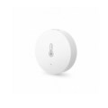|Capteur de température / humidité|lumi.sens lumi.sensor_ht||
|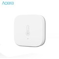|Capteur de température / humidité / pression atmosphérique|lumi.weather||
|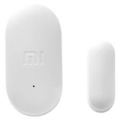|Détecteur ouverture de porte|lumi.sensor_magnet||
||Détecteur ouverture de porte Aqara|lumi.sensor_magnet.aq2||
|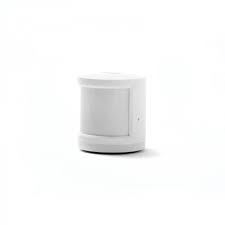|Détecteur de mouvement|lumi.sensor_motion||
||Détecteur de mouvement aqara|lumi.sensor_motion.aq2||
|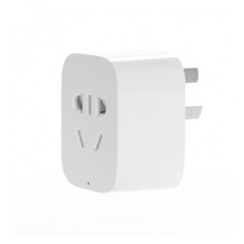|Prise pilotée|lumi.plug||
|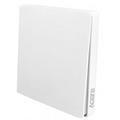|Interrupteur mural sur pile simple touche|lumi.sensor_86sw1||
||Interrupteur mural sur pile double touche|lumi.sensor_86sw2||
|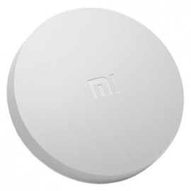|Bouton|lumi.sensor_switch||
||Bouton aqara|lumi.sensor_switch.aq2||
|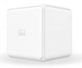|Cube magic|lumi.sensor_cube lumi.sensor_cube.aqgl01||
|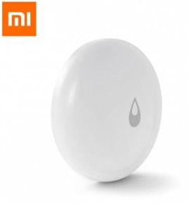|Capteur inondation|lumi.sensor_wleak.aq1||
|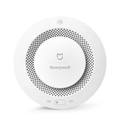|Détecteur de fumée|lumi.sensor_smoke||
|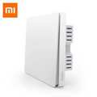||lumi.ctrl_ln1.aq1||

## Références

## Informations générales

## Mode opératoire
